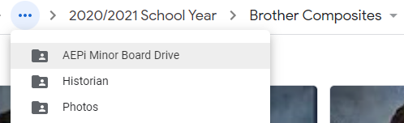
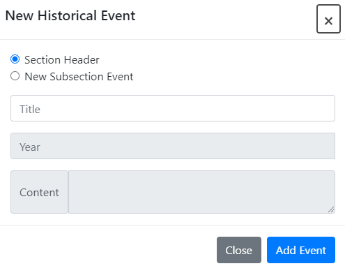
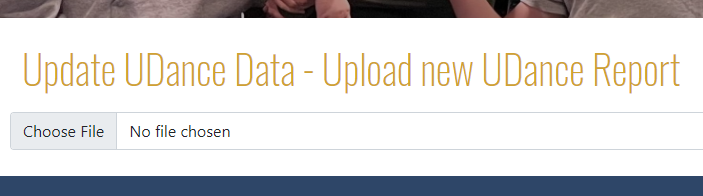
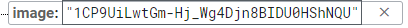

# AEPi Website

This website is for the University of Delaware's Rho Deuteron chapter of the Alpha Epsilon Pi Fraternity.  

The website is based on the Angular framework, driven by typescript, html, and css. Most of the backend is on a Firebase Realtime Database. However, a Google Sheet is used for non-technical brothers to conveniently update the roster.

Created by Ben Raymon 2021

# Future Development
All of the content can be updated through the firebase database (instructions further down). Additionally, some parts can be updated directly from within the website as long as the user is signed in with admin access.

For further development, first clone this repository. The application was originally developed with Angular v12.2.9, Node v14.15.1, and npm v6.14.8. From the base directory, run `npm install` to install the necessary packages. To website can be deployed locally to localhost:4200 with the `ng serve` command. 

The website is currently deployed to GitHub Pages. To build for deployment run `ng build --output-path docs --base-href /aepi_website/`. You must create a file `404.html` under the docs folder and paste in the contents of `index.html` (required for routing to work with GitHub Pages). 

# Updating The Content
## Text Blurbs
If an admin is signed in, certain areas of text become editable. 

Text areas that are editable will have a "Save Changes" button below the section of text. Some areas of text will also have buttons to add and remove paragraphs. To edit the text, simply click into the paragraph and start typing. When you are done making changes, hit the "Save Changes" button to commit your edits.  

These buttons will only be visible if an admin is signed in. Only brothers with admin privileges will be able to edit text content on the website.  

## Roster / Composite
The "Brothers of AEPi" page reads the information from a google sheets document. The Roster document can be found in both the AEPI Information Drive and the AEPI Executive Board Drive folders. 

The roster contains information including the Brother's full name, UD and non-UD email address, phone number, year, major, minor, board position (if applicable), and a composite image. 

However, only basic information is shown on the website. The Brother's phone number and emails are not publicly shown.

### Adding / Removing Brothers
To update the composite on the website, simply add or remove brothers from the roster document and the website will be updated automatically.

### Updating Composite Images

Currently, the composite images are stored under the AEPI Minor Board Drive -> Historian -> Photos -> X/Y School Year -> Brother Composites. 

To add or update an image, drop a picture into the corresponding Brother Composites folder. Then share the image and make sure anyone with the link can view it. Copy the IMAGE-ID from the share link and paste it into the "Image" row of the roster document. 

https://drive.google.com/file/d/IMAGE-ID/view?usp=sharing

If no image is provided, a template blank profile image will be used.

## Adding Historical Events

Admins will see a "Create new event" button at the bottom of the history page. A form will pop-up to prompt input of the desired information. 

If you want to create a new section header/divider, leave "Section Header" checked. If you just want to add an event, click "New Subsection Event". For a section header, all you need to input is the section title. For a new event, enter the title, the year, and the content of your historical event. The year must be later than (or in the same year as) the most recent event and the year cannot be greater than the current year. 

When your information is ready to be added, click "Add Event". The new event/section will be shown once the page is reloaded. 

## UDance

The fundraising data and team donations on our Philanthropy page need to be updated manually. An admin will have access to this portion of the Philanthropy page which allows the user to upload a UDance report file. 

The UDance report can be downloaded by our UDance chair from the official website. The report should be a CSV file titled "UDance 20XX Team Report - yyyy-mm-dd.csv". Please make sure only to upload the correct file to the website. Once uploaded, the total raised and team member dontations will be added to the database and the changes will be visible when the webpage is refreshed. 

# Database

To access the database go to https://console.firebase.google.com/ while signed in under the Rho Deuteron gmail account (aepirhodeuteron@gmail.com). Then click "website" under Your Firebase projects. 

On the left hand side, nagivate to Realtime Database. 

The realtime database holds most of the information that is displayed on the website, including the Eboard, udance link, and the blurbs of information on each page. 

## EBoard
The EBoard information is stored under a boardMembers object in the database. Each boardMember has a name, position, and image. Master and RushChair also have phone numbers that are displayed in the contact page. 

When it is time to update the eboard, you can edit the information by hovering over the right side of the entry (hover over the information part). When your mouse is hovering over the data, a box appears. Click into the box to edit the contents.

Similar to the composite images, enter the IMAGE-ID of the share link to the image you would like to use. This image-id can be the same one that is used in the roster. Edit the name, image, and phone number (if applicable) of each member on the board. When this information is changed, the website will update to reflect the new board members. 

## Text Blurbs (via database)

In addition to the edit functionality that is available within the website, you can also edit the text content from the database. 

Each number under blurb represents a new paragraph. Edit the text in the quotes to change the text that is shown on the website. This is also where you would update the udance link and the rushcard image. 

## Editing Historical Events

The historical events are saved in the database under History --> Events. You can add new events through the pop-up form in the website, but you can also edit events through the database. Editing an event works the same way as editing any other information in the database. 

Click on the text in quotes to change the title, year, or content of the event. The "period" item is for section headers. If the event is a section header then period will be true. If the event is just a historical event, then the period will be false.

# Contact 
For any questions about the database, or any other information about the website, reach out to Ben Raymon. 

Phone: 973-738-0763

Email: BenDRaymon@gmail.com