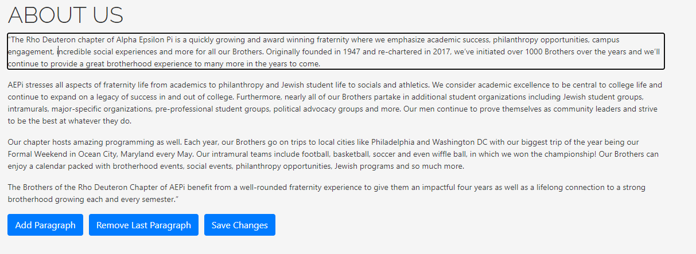

# AEPi Website

Created by Ben Raymon 2021

# Editing Content of the Website
## Text Blurbs
If an admin is signed in, certain areas of text become editable. 

Text areas that are editable will have a "Save Changes" button below the section of text. Some areas of text will also have buttons to add and remove paragraphs. To edit the text, simply click into the paragraph and start typing. When you are done making changes, hit the "Save Changes" button to commit your edits.  

These buttons will only be visible if an admin is signed in. Only brothers with admin privileges will be able to edit text content on the website.  

## Roster / Composite
The "Brothers of AEPi" page reads the information from a google sheets document. The Roster document can be found in both the AEPI Information Drive and the AEPI Executive Board Drive folders. 

The roster contains information including the Brother's full name, UD and non-UD email address, phone number, year, major, minor, board position (if applicable), and a composite image. 

However, only basic information is shown on the website. The Brother's phone number and emails are not publicly shown.

### Adding / Removing Brothers
To update the composite on the website, simply add or remove brothers from the roster document and the website will be updated automatically.

### Updating Composite Images

Currently, the composite images are stored under the AEPI Minor Board Drive -> Historian -> Photos -> X/Y School Year -> Brother Composites. 

To add or update an image, drop a picture into the corresponding Brother Composites folder. Then share the image and make sure anyone with the link can view it. Copy the IMAGE-ID from the share link and paste it into the "Image" row of the roster document. 

https://drive.google.com/file/d/IMAGE-ID/view?usp=sharing

If no image is provided, a template blank profile image will be used.

# Database

To access the database go to https://console.firebase.google.com/ while signed in under the Rho Deuteron gmail account (aepirhodeuteron@gmail.com). Then click "website" under Your Firebase projects. 

On the right hand side, nagivate to Realtime Database. 

The realtime database holds most of the information that is displayed on the website, including the Eboard, udance link, and the blurbs of information on each page. 

## EBoard
The EBoard information is stored under a boardMembers object in the database. Each boardMember has a name, position, and image. Master and RushChair also have phone numbers that are displayed in the contact page. 

When it is time to update the eboard, you can edit the information by hovering over the right side of the entry (hover over the information part). When your mouse is hovering over the data, a box appears. Click into the box to edit the contents.

Similar to the composite images, enter the IMAGE-ID of the share link to the image you would like to use. This image-id can be the same one that is used in the roster. Edit the name, image, and phone number (if applicable) of each member on the board. When this information is changed, the website will update to reflect the new board members. 

## Text Blurbs (via database)

In addition to the edit functionality that is available within the website, you can also edit the text content from the database. 

Each number under blurb represents a new paragraph. Edit the text in the quotes to change the text that is shown on the website. This is also where you would update the udance link and the rushcard image. 

For any questions about the database, or any other information about the website, reach out to Ben Raymon. 

Phone: 973-738-0763

Email: BenDRaymon@gmail.com